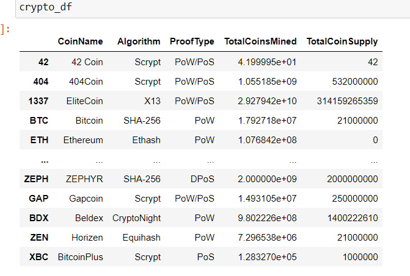
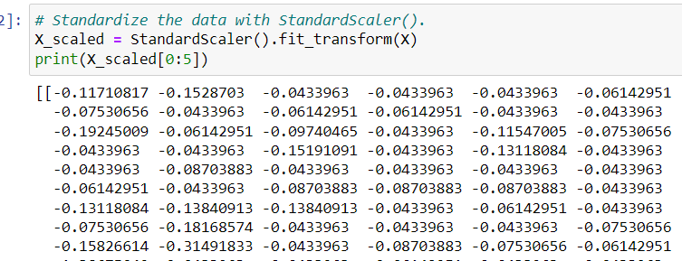
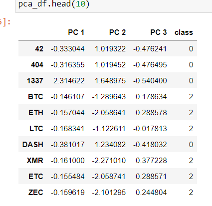
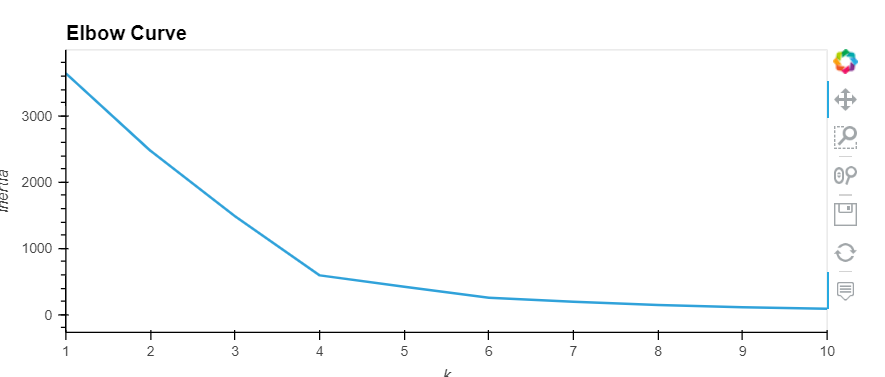
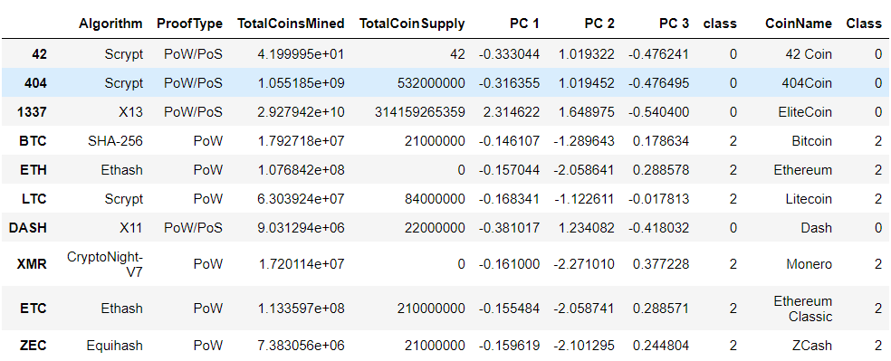
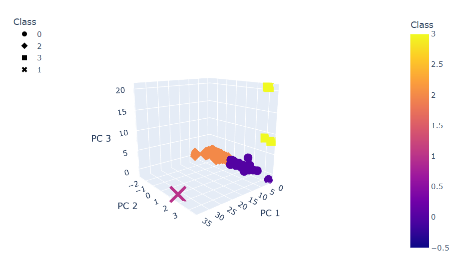
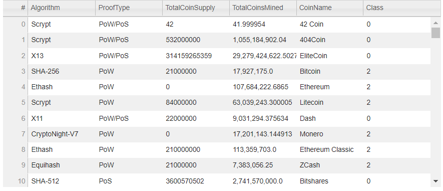
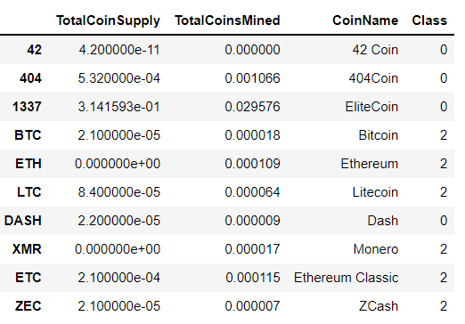
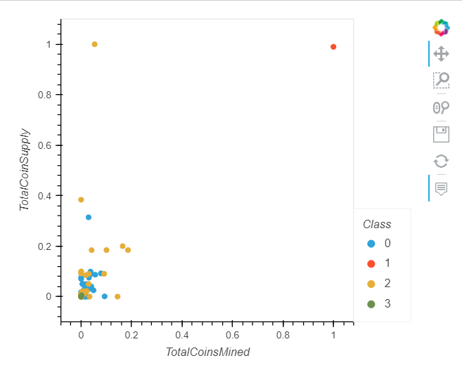

# Cryptocurrency
## Purpose:
In this analysis we get to create a report that includes what cryptocurrencies are on the trading market and how they could be grouped to create a classification system for a new investment. We use unsupervised machine learning to look at trends and advice on which crypltocurrency would be aggod one to invest in.
## Results:
- We started with claening the dataset, by dropping, removing  and creating a new dataframe.

Then we used the *StandardScaler* function to standardize the features from the df we created.

- In the next step we applied the *Principal Component* Analysis (PCA) algorithm, to reduce the dimensions of the X DataFrame to three principal components.
 
- In the next step with the help of *K-means elbow curve* was created.

Clustered dataframe was one of the outputs.

- A *3D scatter plot* using the Plotly Express scatter3d function was used to plot the three clusters from the clustered_df DataFrame from above as shown below.

- Next scatter plots were created with Plotly Express and hvplot, and we were able to visualize the distinct groups that correspond to the three principal components. For this first hvplot table was created.

After this a new dataframe was created that contained the scaled data as seen below with CoinName and Class columns.
.
_ Finally, an c*hvplot scatter* plot was created showing 4 different classes.

## Summary:
 In short, unsupervised machine learing was used effectively to view and analyze an unstructured data like cryptocurrencies. This shows us how useful can machine learning be in analyzing such datasets. We aslo learned how to process data, to cluster, how to reduce your dimensions, and how to reduce the principal components using PCA.
 Finally, this helped us to understand the distribution and also to understand which are the most profitable cryptos.